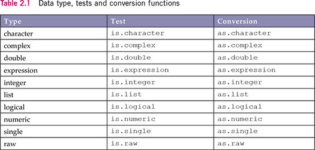

# GEOG 491/891: Special Topics - Spatial Analysis in R

## 

## Week 02.01: Data structures and programmatic thinking

### Dr. Bitterman

## 

---

# Today's schedule

- Open discussion
- Data structures
- Exercises

---

## Anything to discuss? Questions?

---

# Some handy dandy operations on vectors

### First, create a vector
```r
x <- seq(1:20) # what does this do? How would you know?

# alterative method... seq is an "overloaded" function <- what does this mean?
x <- seq(1, 20, 1) 
```

### Operations

```r
sum(x)
mean(x)
median(x)
sd(x)
length(x)
```

---

# Data types



---

# Factors can be a pain

* What's a "factor" according to your book?
* What are some key properties of factors?
  * Ordering
  * Levels

---

# Interrogating types


### the typeof() function
```r
typeof(8675309)
typeof(integer(8675309))

typeof(TRUE)

typeof("banana")

typeof(rep(1, 10))

typeof(list(1, 3, 4, "orange"))
```

---

# Let's look more closely at data frames and tibbles

### From the course GitHub page, get "ne_counties.csv" (it's in the data folder)
(https://github.com/pjbitterman/UNL_GEOG_491_891)
```r
library(tidyverse) #get the helper functions

# read the data
mydf <- read_csv("./data/ne_counties.csv)

# look at it
mydf
```

### What do you see?

---

# The value of exploratory data analysis (EDA)

- When you first get new data, it's a good idea to look at it before starting work
- Many ways of doing so... like what?

```r
summary(mydf) # what do you get?

# How many observations does your data have?
nrow(mydf)
# and attibutes?
ncol(mydf)

# an easier way to look at attributes
glimpse(mydf)

# access a single attribute
mydf$Total # Total population
summary(mydf$Total)
hist(mydf$Total)

```

---

# Subsetting your data

- Often you need to filter your data such that only those observations meeting certain criteria are retained (or removed)

```r
# requires dplyr/tidyverse
dplyr::filter(mydf, Total > 10000 & MedHousInc < 40000)
```

### Another way to write that function

```r
mydf %>% dplyr::filter(., Total > 10000 & MedHouseInc < 40000)
```
What's the ```%>%``` and how does it work?

---

# The pipe ```(%>%)```

- from magrittr package
- essentially says "take what's on the left and pass it to the right"
###
- R assumes you want to pipe to the first argument of the right-hand function, but...
- you can explicitly place the output of the pipe using a ```.``` on the right-hand side 

```r
mydf %>% dplyr::filter(., Total > 10000 & MedHouseInc < 40000)
```

### But what's the point? (to the whiteboard!!!)

---


# Writing your own function

### syntax is a bit weird, so let's break it down
```r
myfirstfunction <- function(x, y){
  x + y
} 
```

### then call the function (make sure it's in memory first)
```r
myfirstfunction(4, 8)
```

---

# If there's time...

- In small groups, figure out how you'd do the following:
- Write a function that takes two integers. If **both are even** or **both are odd**, the function returns **TRUE**. Otherwise, it returns **FALSE**

## 

- Start with the algorithm, NOT the code
- Then try to write the function

---

# A second exerice (pseudocode ONLY)

### The problem:

- I've given you a raster file of Missisquoi Bay in Lake Champlain
- Each cell has a value corresponding to the concentration of cyanobacteria
-. I want you to tell me the area of the Bay (in m<sup>2</sup>) that correspond to the HIGH, MEDIUM, and LOW health risk categories from the World Health Organization

### The big picture questions:
1. What do the algorithm(s) look like?
2. What other information do you need?

### Bonus
- Algo. to measure distance from a harmful algal bloom (HAB) to an arbitray location 

---

# Review and next class

- Any questions?

- This week’s readings/tasks: 
  - Chapter 2 in textbook
  - Continue to review Hadley's book/site
  - Practice on your own


